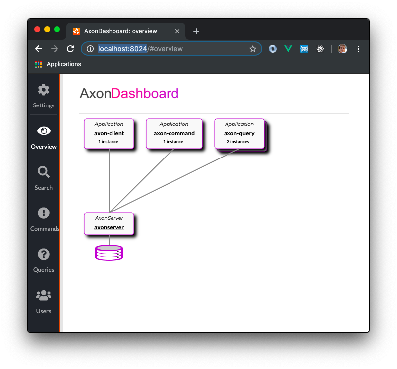
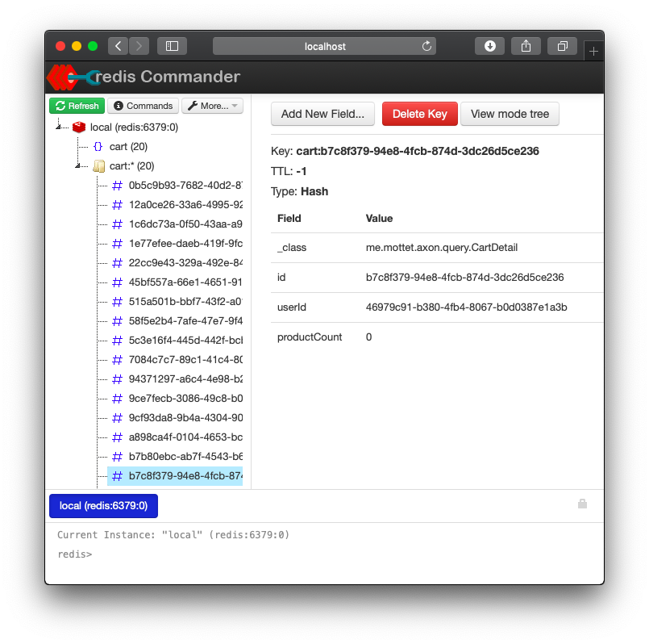

# Cart Kata using Axon 4.1

## Requirement

* docker-compose
* java 8

## Run

* Start Redis, Redis GUI, AxonServer: `docker-composer up` 
* Build app: run `./mvnw package` 
* Start domain: `java -Dspring.profiles.active=domain -jar target/axon-0.0.1-SNAPSHOT.jar`
* Start query: `java -Dspring.profiles.active=query -jar target/axon-0.0.1-SNAPSHOT.jar`
* Start client: `java -Dspring.profiles.active=client -jar target/axon-0.0.1-SNAPSHOT.jar`

## How to

## Admin
* Access AxonServer UI: http://localhost:8024

* Access to Redis UI: http://localhost:9090

 

