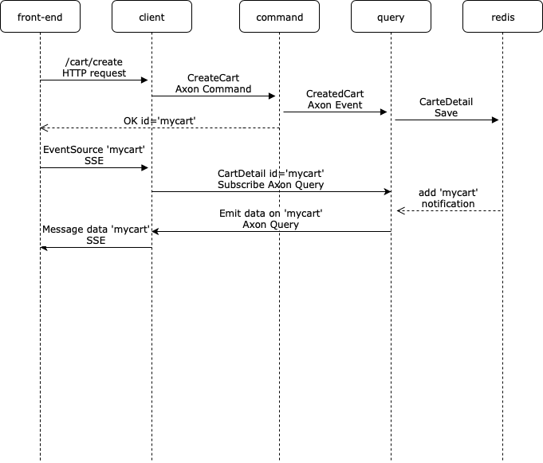
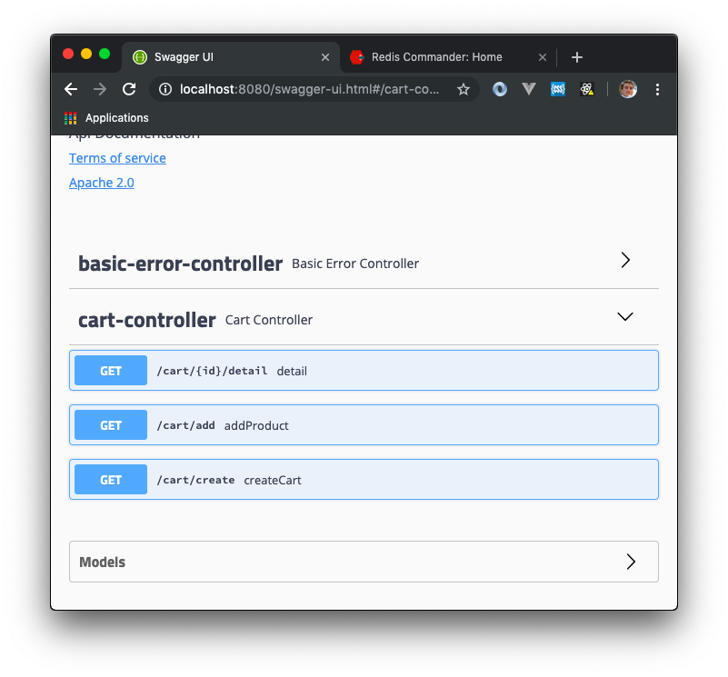

# Cart Kata using Axon 4.1

## Requirement

* docker-compose
* java 8
* yarn

## Run

* Start Redis, Redis GUI, AxonServer: `docker-composer up` 
* Build app: run `./mvnw package` 
* Start domain: `java -Dspring.profiles.active=domain -jar target/axon-0.0.1-SNAPSHOT.jar`
* Start query: `java -Dspring.profiles.active=query -jar target/axon-0.0.1-SNAPSHOT.jar`
* Start client: `java -Dspring.profiles.active=client -jar target/axon-0.0.1-SNAPSHOT.jar`
* start front-end: `cd front-end && yarn dev`
* Go to: http://localhost:3000

## How to

## Problematics

### Data synchronization

The problem with CQRS/Event Sourcing is when you write data (by sending a command) is not transactional, you don't know when your view/projection will 
be updated. When your **front-end** app send a `CreateCart` http request, **client** app will just acknowledge the command if everything went
well or not, but you have no clue if your **query** app have build the projection.

Solutions:
* In your **front-end** app, retry request until the data is available. PRO: simple, easy? CON: Lot of request, flood network until the data is available
* In your **client** app, you can make the command transactional by adding in the transaction the time to put the projection updated. PRO: like the old way (meh!) CON: difficult and you need to have a compatible infrastructure 
* In your **client** app, expose a subscriber (like realtime database from firebase) end point so **front-end** app can be advertise on every change. PRO: clean, scalable CON: difficult and you need to have a compatible infrastructure
 
I prefer the **last solution**, it's more elegant, clean and scalable. The good things is we can do it with the actual infrastructure: Redis and AxonServer 
* You can configure **Redis** by setting the option `notify-keyspace-events` (in ./docker-compose.yml) that send a message on every set/add/update on redis data. 
* **AxonServer** give us `subscriptionQuery` that allow us to subscribe to every change on a query
* In **front-end** app we will use Server Sent Event to receive in real time data changed

BONUS: with this solution all the devices connected to the same cart will be updated in real time.

### Work with legacy

### Metrics

## Admin
* Swagger UI: http://localhost:8080/swagger-ui.html

* Access AxonServer UI: http://localhost:8024

* Access to Redis UI: http://localhost:9090

 

